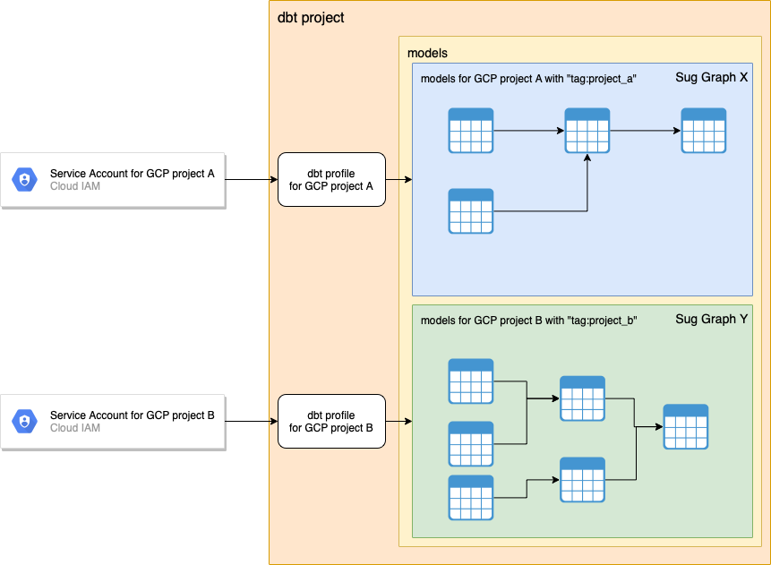

# Reproduce the issue of dbt with multiple service accounts and sub DAGs
The repository is to reproduce the issue of [https://github.com/dbt-labs/dbt-bigquery/issues/104](https://github.com/dbt-labs/dbt-bigquery/issues/104).

## Environment
- python: 3.8.8
- dbt: 1.0.0
  - dbt-bigquery: 1.0.0
- Google Cloud BigQuery

## Issue
I have some sub DAGs which are mutually exclusive.
Moreover, I used different service accounts corresponding to a sub independent DAG.
However, it doesn't work because of the lack of permissions of service accounts for 

## Expected Behaviors
I would like to skip getting and creating schemas which are not selected with the model selection syntax, because dbt==0.21.0 prevents 

The image illustrates a simplified our desired use case.
Let's consider the service account for GCP project A has permissions to only GCP project A.
It has no permissions to GCP project B.
However, dbt doesn't work due to the lack of permissions.

When we want to deal with only resources in sub graph X (the blue area) using the service account for GCP project A, we want to skip getting and creating schema of non-selected resources in sub graph Y (the green area).




## Reproduce the Issue
The procedure is to reproduce the issue.

### Install dbt
First of all, we install `dbt`
```bash
pip install -r requirements.txt
```

### Create service accounts and IAMs
We take advantage of impersonated service accounts so that we easily reproduce the issue.

We create two service accounts to grant mutually exclusive permissions.
Each service account can read a corresponding BigQuery dataset.
Your GCP account can impersonate them.
For example, the service account `test-dataset1-accessor` can read the BigQuery dataset `test_dataset1` as well as your GCP account can impersonate `test-dataset1-accessor`.


```bash
$ cd terraform
$ export PROJECT_ID="your-gcp-project"
$ export YOUR_GCP_ACCOUNT="your-gcp-account@example.com"
$ terraform init
$ terraform apply -var "project_id=${PROJECT_ID}" -var "your_gcp_account=${YOUR_GCP_ACCOUNT}"
```

### Execute dbt
[resources/dbt.log](./resources/dbt.log) is the logs as a result of executing the commands below.

Because the service account `test-dataset1-accessor` doesn't have any permissions to access the dataset `test_dataset2`, it was failed to get the list of tables in the dataset `test_dataset2`.

#### `dbt compile`
```
$ export PROJECT_ID="your-gcp-project"
$ dbt compile --profiles-dir profiles --target dataset1 --select "tag:test_dataset1" 
Running with dbt=0.21.0
Partial parsing enabled: 0 files deleted, 0 files added, 0 files changed.
Partial parsing enabled, no changes found, skipping parsing
Found 2 models, 0 tests, 0 snapshots, 0 analyses, 185 macros, 0 operations, 0 seed files, 0 sources, 0 exposures

Encountered an error:
403 GET https://bigquery.googleapis.com/bigquery/v2/projects/your-gcp-project/datasets/test_dataset2/tables?maxResults=100000&prettyPrint=false: Access Denied: Dataset your-gcp-project:test_dataset2: Permission bigquery.tables.list denied on dataset your-gcp-project:test_dataset2 (or it may not exist).
```

#### `dbt run`
```
$ export PROJECT_ID="your-gcp-project"
dbt run --profiles-dir profiles --target dataset1 --select "tag:test_dataset1" 
Running with dbt=0.21.0
Partial parsing enabled: 0 files deleted, 0 files added, 0 files changed.
Partial parsing enabled, no changes found, skipping parsing
Found 2 models, 0 tests, 0 snapshots, 0 analyses, 185 macros, 0 operations, 0 seed files, 0 sources, 0 exposures

Encountered an error:
403 GET https://bigquery.googleapis.com/bigquery/v2/projects/your-gcp-project/datasets/test_dataset2/tables?maxResults=100000&prettyPrint=false: Access Denied: Dataset your-gcp-project:test_dataset2: Permission bigquery.tables.list denied on dataset your-gcp-project:test_dataset2 (or it may not exist).
```

## Cleanup
```bash
$ cd terraform
$ export PROJECT_ID="your-gcp-project"
$ export YOUR_GCP_ACCOUNT="your-gcp-account@example.com"
$ terraform init
$ terraform destroy -var "project_id=${PROJECT_ID}" -var "your_gcp_account=${YOUR_GCP_ACCOUNT}"
```
